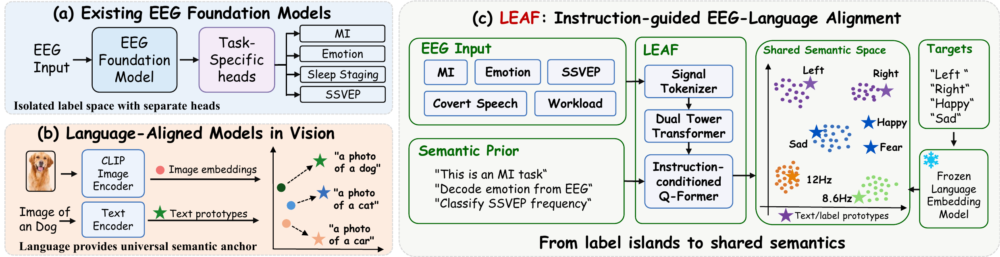
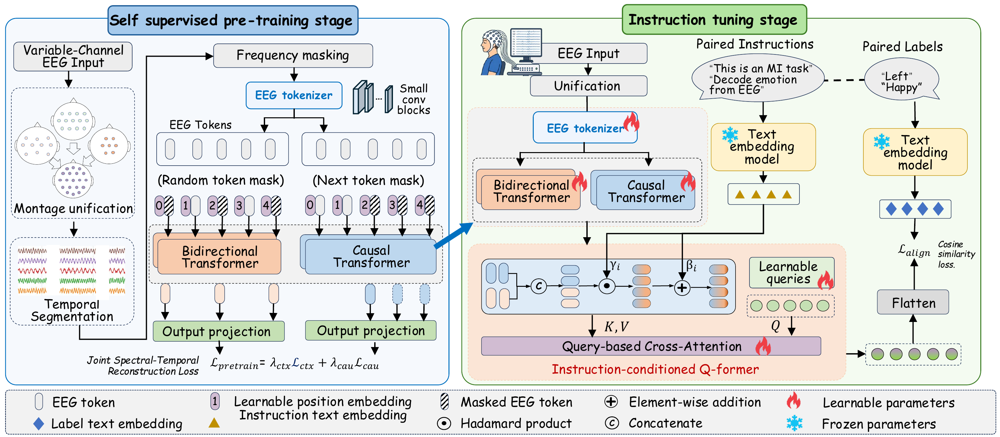

# LEAF

**Language-EEG Aligned Foundation Model for Brain-Computer Interfaces**

[Project page](https://leaf-bci.github.io/) · [Paper](https://arxiv.org/abs/2509.24302) · [Documentation](https://leaf-bci.github.io/docs/) · [Checkpoints](https://github.com/Jiang-Muyun/LEAF/releases)

LEAF aligns EEG representations with natural-language instructions and label semantics. It combines self-supervised EEG pretraining with instruction tuning, enabling direct inference across multiple BCI tasks using text embeddings as class prototypes.

<p align="center">
  
</p>

<p align="center">
  
</p>

## Quick start

Configure the raw, pretraining, and downstream dataset paths in `configs/env.yaml`. Dataset preprocessing scripts are provided in `leaf_datasets/`.

Download the released checkpoints into `checkpoints/`, then run direct inference:

```bash
wget -c -P checkpoints https://github.com/Jiang-Muyun/LEAF/releases/download/v1.0/leaf-v1.0-pretrain.ckpt
wget -c -P checkpoints https://github.com/Jiang-Muyun/LEAF/releases/download/v1.0/leaf-v1.0-instruct-mpnet-base.ckpt
```

Alternatively, download both files with `bash download_checkpoints.sh`.

```bash
python c_inference.py \
  --config configs/LEAF_mpnet.yaml \
  --ckpt leaf-v1.0-instruct-mpnet-base.ckpt \
  --gpu 0 --bs 512 --level 0,1,2
```

To run the training stages:

```bash
# Self-supervised EEG pretraining
python a_pretrain.py --config configs/LEAF_mpnet.yaml --bs 256 --gpu 0,1

# Instruction tuning from the released pretrained Tower
python b_instruct_tuning.py \
  --config configs/LEAF_mpnet.yaml \
  --pretrain_ckpt leaf-v1.0-pretrain.ckpt \
  --bs 256 --gpu 0,1 --seed 0
```

See the [documentation](https://leaf-bci.github.io/docs/) for dataset preparation, training settings, and evaluation details.

## Citation

```bibtex
@article{jiang2026leaf,
  title={LEAF: Language-EEG Aligned Foundation Model for Brain-Computer Interfaces},
  author={Jiang, Muyun and Zhang, Shuailei and Yang, Zhenjie and Wu, Mengjun and Jiang, Weibang and Liu, Chenyu and Guo, Zhiwei and Zhang, Wei and Liu, Rui and Zhang, Shangen and Li, Yong and Ding, Yi and Guan, Cuntai},
  journal={arXiv preprint arXiv:2509.24302},
  year={2026}
}
```
